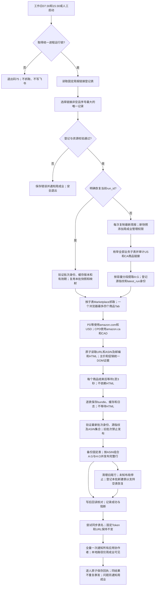

# SPEC：Amazon 周报前端价格捕捉任务

> 当前规格，更新于2026-08-26。只维护本文件这一套业务口径。实现差距必须明确记录在[REVIEWS](REVIEWS.md)，测试与历史证据在[TASKS](TASKS.md)；不得把规格要求当作已经通过真实验收。
>
> 旧版已完整保存到[历史目录](history/README.md)，其中“每周新建结果表”“HTML门禁”“仅下午执行”“8月31日截止”不再是当前规则。

## 1. 目标与边界

每周一至周五北京时间07:30、15:30执行价格任务，每天两次、无截止日期、周末不执行。不依赖GPT界面；依赖Windows开机、交互账号登录和可用网络。

从固定链接登记表选择最新周报，每次新的正式批次都复制该周报的最新内容作为本批只读完整快照，重新发现业务子表、提取A:G并抓取Amazon实时价格，最后写入同一个固定结果Spreadsheet。固定的是字段位置和结果链接，不是A:G的数据。明确恢复已有run_id时才复用原批快照，禁止混用新基础数据和旧价格。

价格任务与HTML独立：正式 `--weekly-run` 和 `--weekly-push-only` 强制关闭HTML捕获、HTML必需门禁和HTML服务依赖；默认配置、实际配置及模板均关闭归档与服务。既有HTML只读留存，不清理、不改名、不提交Git；8765服务和自启动任务停用。代码与手工脚本保留，日后如要恢复必须作为独立功能重新验收。禁止使用旧HTML替代实时价格。

### 1.1 端到端流程图

凡涉及数据来源、换周、列布局、抓取、交付或通知的变更，必须同步更新此图和对应章节。



跨子表不是云端原子事务；每段回读后计入成功，局部写入失败保留已成功范围并继续其他子表，不承诺瞬时全表切换。真实运行待验收项见REVIEWS。

## 2. 运行环境与依赖

Windows、Python 3.10+、Chromium/DrissionPage。Python依赖以 `config/requirements.txt` 为准。HTML封装依赖仅用于独立HTML功能，不是正式价格运行前提。

飞书应用需要读取登记表、Wiki和周报，复制原表、管理新快照协作者、读取及编辑固定结果表和必要时添加业务子表，以及查询应用协作者并发送消息。应用可用范围与文档访问权限是两件事，不自动扩大任一范围。

## 3. 配置与来源

- 非敏感配置：`app/config.py` 默认值 → `config/config.json`；模板为 `config/config.example.json`。
- 敏感配置：根目录 `.env`，兼容本机 `.env/飞书凭证.txt`；同名系统环境变量优先。
- `.env.example` 仅列出 `FS_APP_SECRET`，不是第二套业务配置。JSON不得包含真实Secret或 `feishu_app_secret` 配置项。
- 兼容凭证文件为两个非空行，App ID必须与JSON一致；不要同时维护多份本地Secret。
- 正式任务的子表列表及Marketplace来自本批最新快照发现结果；旧静态sheets/sheet_profiles不是全量范围上限。
- `outputs/weekly_runs/fixed_result.json` 是固定云端资源身份登记，不是重复的配置来源；部署迁移必须保留。

新增配置时同步代码默认值、模板、SPEC及测试；Secret还需同步环境变量模板和脱敏测试。禁止在日志、manifest或Git中保存Secret、tenant access token、Cookie和Authorization。

## 4. 目录结构与文档职责

```text
amazon_daily_structured_20260821/
├── README.md                       最短入口与文档导航
├── 启动中心.bat                    旧人工菜单，当前限制见第18节
├── .env.example                    Secret变量模板
├── app/
│   ├── main.py                     CLI编排、抓取、交付、通知
│   ├── config.py                   配置加载与验证
│   ├── models.py / pricing.py      结果模型与Decimal计算
│   ├── feishu.py                   飞书API、源行解析与本地备份
│   ├── weekly_registry.py          登记表选择与URL校验
│   ├── weekly_assets.py            周资源、manifest、固定表身份和锁
│   ├── weekly_mapping.py           全部子表发现与映射
│   ├── product_links.py            ASIN、域名与Marketplace
│   ├── weekly_execution.py         价格专用配置与每批快照准备
│   ├── weekly_result.py            基础行发布、列迁移与写后核对
│   ├── result_notification.py      通知模板、收件人过滤与发送
│   ├── cache.py / exporters.py     快照缓存、CSV
│   ├── runtime_state.py            统一进程锁、独立临时文件与持久化原子JSON
│   ├── publication_guard.py        最新批次登记及发布/改名防过期门禁
│   ├── sheet_io.py                 按表容量分段读取，保留绝对行号
│   ├── diagnostics.py              异常证据
│   ├── amazon/                     浏览器Tab、页面解析和选择器；price_evidence.py限定主价DOM与币种证据
│   └── html_*.py / archive_*.py / offline_verify.py / mhtml_compare.py
│                                    独立HTML捕获、留存、服务和验证
├── config/                         本机JSON、模板及requirements.txt
├── bin/                            安装、人工运行、Windows调度和HTML服务脚本
├── docs/
│   ├── SPEC.md                     唯一当前规格，含流程、操作与验收
│   ├── TASKS.md                    实施任务、验证耗时及历史证据
│   ├── REVIEWS.md                  当前未解决评审意见
│   ├── README.md                   文档阅读导航
│   ├── 操作手册.md                 旧路径跳转，不复制操作规则
│   ├── 当前业务规则.md             旧路径跳转，不复制业务规则
│   ├── 交付清单.md                 旧路径跳转，不复制验收规则
│   └── history/                    已被替代的文档，仅供追溯
├── tests/                          离线单元与流程测试
├── sandbox/ / tools/               探针与辅助工具，非正式入口
├── htmls/                          可选HTML文件，默认归档根
├── outputs/                        运行证据及必须备份的资源状态
├── data/                           本地数据
└── tmp/                            临时文件
```

不为目录形式将app迁移为src。运行产物不写入源码、配置或docs目录。不把outputs整体视为可删除缓存：fixed_result.json、weekly manifests、交付记录和备份必须保留。

文档同步：需求/流程/字段先改SPEC，实施和耗时写TASKS；未解决问题写REVIEWS，解决后移入TASKS并清除待审项。目录或入口变化同步两个README及旧路径导航。历史记录明确标注已替代，不重新当作操作指令。用户提供的工程规范手册为参考，不复制成另一份项目SPEC。

## 5. 字段与结果布局

表头第2行，数据从第3行开始。当前业务布局为A:O，共15列；不存在HTML业务列。

| 列 | 字段 | 来源或含义 |
|---|---|---|
| A:G | ASIN、SKU、尺寸、正常售价、本周折扣形式、本周折扣%、目标成交价 | 每次正式运行从最新周报副本重新提取；固定列位，不固定内容 |
| H | 展示价格 | 当前商品主购买区价格 |
| I | 折扣类型 | 页面证据决定的四类优惠之一 |
| J | 折扣值 | 百分比或金额，按第6节类型解释 |
| K | 最终价格 | 根据展示价格及有效优惠计算 |
| L | 一致性检查 | 最终价格与目标成交价的比较 |
| M | 时间戳 | 本条抓取/计算时间；不是表名更新时间 |
| N | 币种 | US为USD、CA为CAD |
| O | Amazon链接 | 本商品标准URL |

旧系统A:P中N为HTML、O为币种、P为Amazon链接。识别完全匹配的旧表头或当前表头后才允许备份发布；每批重新组合A:G与H:O，并把P置空。清空P不等于删除物理列，未知表头不得覆盖。完整行使用A:P技术范围，P只清理旧值，不是新增业务字段。同周也更新A:G，不能沿用旧目标价或旧SKU。

ReportRow记录源行、ASIN、基础字段和目标价来源；CrawlResult记录页面状态、价格证据、run_id、站点、币种、页面URL和耗时。完整诊断保存在本地，不要求全部上表。

## 6. 价格与折扣规则

只按当前商品购买区的真实页面证据分类：coupon > code > 价格折扣 > 原价调整。周报预期类型仅用于诊断，不替代页面事实。

| 类型 | 最终价格 | 折扣值 |
|---|---|---|
| 原价调整 | 展示价格 | 目标成交价减正常售价，金额 |
| code | 展示价格 × (1-code百分比) | code百分比 |
| 价格折扣 | 展示价格，不重复打折 | 主价区Save百分比 |
| coupon | 优先明确券后价；否则展示价减Saving金额；否则展示价 × (1-coupon百分比) | 对应页面优惠百分比或金额 |

计算使用Decimal、ROUND_HALF_UP，金额两位小数。同币种 `abs(最终价-目标价) <= price_tolerance` 为一致，当前容差0.50；US单位USD、CA单位CAD，不做汇率换算。

目标成交价优先使用源表已有数值；来源标记为feishu_value、excel_cached_value、local_fallback或missing。本地兜底按源字段计算：本周类型为原价调整/原价定档/原价且折扣值>1时取该绝对价格；值空或0取正常售价；0<值<1取正常售价×(1-值)；其他取正常售价。缺少必要源值标记source_data_invalid，不假造价格。

证据必须锚定当前商品主价、Buy Box或促销控件：

- Coupon来自aria-label、couponText、couponLabelText、ct-coupon-tile等控件；Saving金额与Coupon在同一控件。
- Code来自购买区alert/promotion中的Save X% at checkout等文案。
- Save%来自主价容器或priceToPay邻近savings元素。
- 评论、问答、推荐商品、脚本模板中的促销词不得参与计算。
- 主价按DOM容器边界提取，排除隐藏、推荐、脚本、划线价格及USED/REFURBISHED二手购买区节点；删除全页面首个价格兜底。主价冲突为parse_error；没有可靠主价且没有当前商品availability控件的明确售罄文案，也为parse_error，不能猜测售罄。
- 页面真实Coupon与Code同时存在时仍选Coupon。规则变化需要递增parser_rule_version并重抓或重新解析，不能继续信任旧计算缓存。

Coupon、Code、Save与主价共用DOM树及隐藏/脚本/推荐/评论/二手区排除规则。Coupon金额只能来自同一控件；多个控件优惠不一致、同一控件有多个不同有效比例/金额时标parse_error，不任选第一项。实际浏览器采样会在离线DOM副本标注CSS不可见控件，不修改页面本身。重复且一致的控件证据可去重。

比例须大于0且小于100%；优惠金额不得为负或超过展示价格，Coupon最终价须大于0且不超过展示价格；NaN/Infinity拒绝，零价格容差按严格零执行。源正常售价/目标价为负或非有限数时作为源数据异常，不生成正常价格结果。

## 7. 交付与安全边界

正式价格流程按安全行交付，不因技术异常率超过10%而整批零写入。阈值用于告警；身份、币种、结构和run_id校验不能由force-push绕过。

1. 先保存源快照与逐表bundle，再调用交付。
2. 全局预检目标、表头、ASIN唯一性和run_id；每个选定子表的源商品集合与结果集合必须完全一致，缺失、重复或多余ASIN都在写前阻断。
3. 修改每个结果子表前本地备份；同run_id重试保留首次原备份。
4. 按本批快照顺序组合完整A:G和同ASIN的H:O，每段最多200行；覆盖新增、修改、排序和删除后尾行清理，写后核对整段A:P，不先清空再等待抓取。
5. 只有回读通过才计入已验证写入，另记base_rows_written基础字段更新数。某表/范围失败保留已成功数量，继续其他安全子表；同run_id可重试，不把已有成功写入全部统计为0。
6. 技术异常或币种错误仍同步本批基础字段，但清空本条价格并标记-，不沿用旧价格配新目标价；记录阻断原因。写入失败范围可能保留旧数据，通知提醒核对时间戳。source_data_invalid不抓取，写异常空结果。
7. 改名失败不得阻断本地记录和完成通知，不把预期名称冒充已生效名称。

创建结果子表后立即把Sheet ID登记到本批manifest.pending_result_sheets，再执行备份与写入。临时故障恢复时仅允许该登记身份对应的空表头继续初始化，未知空表仍禁止覆盖；完成后移除待初始化标记。创建API返回前断连或本地登记落盘失败等身份不确定情况仍需人工核对，不凭同名自动认领。

latest_run.json记录最新准备批次（period、run、快照和固定结果Token），与“已发布结果”fixed_result.json分离。发布、每段写入及改名均核对最新登记与磁盘manifest；不能先把固定表指针改成旧周期再校验。只有实际写入回读通过后更新发布指针，整批通过才更新active_result。新批次缺少最新登记或恢复旧版本证据时拒绝发布并要求新抓取。

每批保存A:G源字段指纹；恢复抓取、恢复写入及发布前重读快照时核验。即使ASIN集合没变，只要SKU、尺寸、目标价等变化也不能混用旧价格。映射为空的子表若出现ASIN表头，要求重新建立批次映射。新建run_id在同秒碰撞时增加微秒后缀。

正式源数据、ASIN审计、旧尾行读取和写前备份按元数据行容量分段，每次最多2000行并自限10000单元格，补齐API裁剪的中间空行以保留真实行号；不再把2000当作已知容量表的总上限。源数据读取与表头定位覆盖真实列容量，不限O列。正式客户端元数据缺少行容量时明确停止，不静默截断。结构副本校验逐Sheet ID取样，不依赖批量返回的标题/ID前缀。

自动任务默认覆盖全部发现的业务子表。显式--sheets仅更新选定子表，不动未选表；只有覆盖全部映射且无失败/阻断才更新active_result完整批次索引。整张源子表消失时不自动删除旧结果Sheet（避免破坏链接/权限），旧Sheet不计入当前映射；当前映射内的空表会清理旧数据行。

## 8. 验证原则

业务修改先离线测试，再只读检查，再US/CA最小样本与最小子表，最后全量。每次记录测试开始、结束、耗时、范围、结果和是否真实写入。单元测试不代表真实Amazon可用、真实群发已读或新周云端切换通过。

离线命令见第18节。真实运行的总耗时包含准备、抓取和交付；通知逐人发送耗时可从送达记录/外层调度日志查看，不将采集阶段时间伪装为所有外部投递的总墙钟。

## 9. 浏览器、节奏与超时

正式配置workers=4；每次处理一个子表/Marketplace，使用一个浏览器、最多4个互斥商品Tab，而不是4个浏览器。商品不足4个时减少Tab。US/CA上下文分别初始化，不并发混用邮编。

当前配置：page_timeout=30秒、price_wait_timeout=12秒、per_asin_timeout=90秒、retry=2；风险冷却配置60～180秒。程序对Captcha、访问受限和429/503记录风险，不自动切换VPN/IP，也不绕过验证码。

每个CLI入口（人工、定时、恢复及维护）由Python持有同一个outputs/weekly_scheduler.lock，覆盖准备、抓取、发布、通知全过程。PowerShell仅负责启动与日志，不重复占锁；已有任务时第二个入口以75退出，不改变云端状态。锁文件残留不代表进程仍存活，OS释放锁后可重启。

每个商品完成或失败后等待随机1～3秒再释放Tab，HTML关闭也执行；HTML开启时归档结束后只等待一次。复用post_archive_delay_min/max配置及post_archive_delay_seconds日志字段，不增加另一组重复配置。导航、身份或解析失败需要重试时必须关闭并重建当前Tab，不能让下一次请求继承上一商品页面；重建后的Tab仍由同一worker独占并最终归还池。

导航、文档/价格等待、页面脚本读取和稳定等待按剩余deadline裁剪；禁用导航内部重试，重试只由外层统一执行，每次直接重新导航，不插入额外无预算refresh/rebuild。返回成功前复查截止时间，超时清除价格并标记deadline_exceeded。初始化首页timeout为30秒（不是30000秒）。商品间1～3秒等待不计入90秒抓取预算；浏览器驱动/操作系统失去响应仍不是进程级强制终止保障，不能宣称任何环境下墙钟严格90秒。

## 10. 多站点、ASIN和币种

| 路由 | 域名 | 币种 | 邮编 |
|---|---|---|---|
| PD/XD/PDF等US映射 | www.amazon.com | USD | 90210 |
| CPD对应CA映射 | www.amazon.ca | CAD | M5V 3A8 |

复用同一抓取、解析、计算及写入代码，不复制一套CPD爬虫。CA邮编设置使用M5V、3A8两段；只有页面实际截断为五位时允许visible_prefix5证据，若页面含完整六位则必须完整匹配，M5V3A9不能通过M5V3A8校验；US仍要求完整邮编匹配。链接审计与源行读取统一处理裸ASIN、商品URL及富链接，避免审计通过后商品被解析器静默跳过。

正式setup强制邮编验证，失败时该子表不采信价格；fetch_once也校验location_verified。正常商品页最终host必须匹配目标站点，并从主价原始文本读取币种：US$/USD与CA$/CAD不能互相替代；裸$仅在已验证站点和邮编上下文下解释。币种未知/冲突为currency_error，不参与价格比较。

ASIN提取支持纯编号、普通URL、飞书富文本链接及HYPERLINK公式。显式URL先验证精确host和Marketplace，拒绝恶意子域、非Amazon和跨站URL；坏URL不能退回显示文字中的ASIN绕过检查。标准输出：
`https://www.amazon.com/dp/{ASIN}` 或 `https://www.amazon.ca/dp/{ASIN}`。

导航后先识别明确Page Not Found，再校验最终URL中的商品ASIN。相同ASIN附带?th=1、?psc=1不算异常，也不是邮编证据；正常页跳到其他ASIN属于identity_mismatch并阻断。明确404按page_not_found处理，不误报变体跳转。

成本、颜色、广告等非商品标签跳过并审计；看似商品但编号无效的行记录无效。全部发现到的业务子表参与映射，空模板保留映射、不制造商品；辅助BI源数据排除。新周不得用历史18表名单截断发现结果。

只有US/USD和CA/CAD的已知组合参与价格比较；未知/错误币种为currency_error，禁止写该行正常比较结论。CSV金额单位随站点，不固定USD。

## 11. 独立HTML归档

本节仅定义已保留的独立能力和恢复验收，不是价格任务前置条件。

采用同一已加载Tab生成单个自包含普通.html，解析输入仍是实时页面。SingleFile封装并原子落盘，验证HTML结构、目标ASIN、大小和SHA-256；不能仅凭退出码或扩展名判定成功。不默认二次导航商品或另开浏览器；MHTML只作诊断/对照。

离线验收：断网打开文件后，标题、ASIN、价格、优惠文案、主图和核心可见布局可读，查看不再发起HTTP(S)资源请求。登录、购物车、视频、实时推荐及服务端操作不属于静态快照保证范围。

归档命名：`htmls/YYYY-MM-DD/{run_id}/{子表顺序_名称}/{商品顺序_ASIN}.html`；manifest保存路径、哈希、字节数、时长和状态。每次独立批次用不同run_id。

保留今天及前4个日期目录，共5天；只清理归档根内过期日期目录，不跟随符号链接/Junction越界。检查实际归档卷容量。原先每批约2GB、两批/日是容量估算，不是实测保证；以实测体积留出安全余量。价格入口关闭HTML时不执行归档清理或磁盘门禁。恢复HTML需独立小表及断网验收，不自动加回结果列或价格依赖。

## 12. HTML文件访问

本机文件URL仅指向已存在、位于归档根内的普通.html；URI编码正确，不伪造下载未完成的链接。

独立局域网服务代码及脚本保留但默认关闭；历史默认端口为8765，只读访问归档根。当前自启动任务禁用、监听进程停止、防火墙允许规则保持禁用，既有HTML不删除。价格调度安装/移除不重新开启HTML服务。当前结果表和完成通知均不输出HTML链接或端口状态。不得据此自动开放公网、安装隧道或修改防火墙。

## 13. 日志、恢复证据与通知

当前parser_rule_version为2026-08-26-v4，单表缓存schema=5、weekly bundle schema=2。bundle记录源指纹、规则版本、容差和created_at；恢复必须匹配当前版本/容差/源指纹，且时间不在未来、不超过cache_max_age_hours（默认12小时）。同时验证每条有效商品的采集timestamp，不能通过重存文件给旧价格续期。旧schema、缺少元数据和过期结果拒绝发布，要求重新抓取；不会删除旧证据。版本同时维护config.json、config.example.json及app/config.py默认值。

缓存/manifest/bundle等采用唯一临时文件、flush/fsync后原子替换；线程内替换串行化，单表增量快照的创建与写盘也串行化，避免较旧快照后写覆盖。Tab获取或增量缓存失败逐行/逐次记录，不无声终止工作线程；最终缓存失败保留采集结果交给weekly bundle持久化，bundle落盘失败则不继续发布。

通知每发送一人即保存回执。同run_id、同业务结果恢复时跳过已送达成员，仅重试失败/新成员；跨日期恢复也读取同一回执账本。业务统计变化可发送更新结果。网络超时发生在服务端接收与本地回执之间时，当前不承诺严格exactly-once，须核对message_id/飞书实际送达。

产物路径以第18节为准。run_id贯穿抓取快照、缓存、CSV、bundle、交付记录、目标备份和通知回执。

当前文本日志按log_keep保留最近30个文件，不能写成“已保留30天”；按天轮转尚未实现。debug清理为7天；调度日志、bundle、备份和周资源状态没有通用自动五日删除。五日规则只属于HTML日期目录。

完成通知统一由result_notification.py生成：

- 首行：Hi，有个任务完成请查收.
- 标题：Amazon 周报前端价格捕捉任务
- 分组展示周期、run_id、起止时间、耗时、子表数、写入/阻断数；正式抓取含技术异常率。
- 周期对人显示为run_id日期对应的ISO周（例如2026-W35），并附内部登记序号用于追溯；内部manifest仍使用登记表序号，不能只改通知文字伪造换周。结果表名称同样使用ISO周和run_id。
- 结果表使用实际名称与固定可点击链接；说明文档为[关于上述表格的简要说明](https://wit0jhu6kvu.feishu.cn/wiki/G531wP7WNiepV3krnrHcavqin6d)。
- 不含HTML端口行、证据字样或模拟声明；不能使用虚构数据冒充已执行。
- “本地数据”路径只对feishu_manager_open_id配置的周成业可见；其他人移除整行。
- 动态查询应用协作者、按Open ID去重并包含周成业。逐人发送，一人失败继续其他人；名单查询失败仅通知管理员并记录群发不完整。
- 一批一次全量汇总，不逐子表推送。运行/投递问题另通知周成业；发送成功不等于已读，应用协作者不自动等于文档协作者。

## 14. Docker部署边界

Docker延后，当前不作为已交付部署方式。先完成至少一周本机全量稳定性验证，按当前工作日每天两次覆盖正常时段，并包含失败恢复及换周验证。旧“七个自然日14次且必须下载HTML”不适用于当前价格任务。

若仍需额外补满历史14批门槛，须单独确认验收安排，不擅自新增周末计划。HTML恢复和Docker的容量、断网文件及挂载验证分别安排。

未来部署需持久化weekly manifests、固定表登记、bundle和备份，Secret运行时注入，时区Asia/Shanghai，验证Chromium、网络与重启恢复；不得在镜像里固化凭据。

## 15. Secret和资源权限

App ID为非敏感配置；真实Secret只走第3节来源。不输出完整凭据用于“验证是否存在”。

每次创建本批快照，给配置指定的周成业添加可管理协作者并回查；不从多人名单猜管理员。固定结果表保留已有权限。文档管理权限不能绕过组织分享限制；消息可用范围由管理员维护，程序不自动扩权。

## 16. 周报登记、快照与固定结果表

固定登记入口：[周报链接登记表](https://wit0jhu6kvu.feishu.cn/wiki/HwxpwCnZ7iV1o5klIGbc8wJHnrd)。

实际字段：序号、飞书链接、更新时间。忽略链接空行，非空行序号须为唯一正整数，选最大值；更新时间不参与排序。链接没更新时仍选择当前周报，但新批次会复制其最新内容。最新链接无权限/无效时停止，不退回旧周。同序号更换URL应停止并要求新序号；正式抓取和缓存恢复均验证。

支持/wiki节点解析及/sheets直链，?sheet只定位页面，不限制全表枚举。允许域名与Token白名单校验先于API调用。登记表永久只读。

固定结果：[Amazon周报结果表](https://wit0jhu6kvu.feishu.cn/sheets/Epads8MQkhkuBctjl3lcqLUvnCg)，Token为Epads8MQkhkuBctjl3lcqLUvnCg。正式任务不新建替代表。每个新的正式run_id复制一次当前原始周报，快照名包含period_id/run_id及generation；在应用Drive根目录保存完整副本，记录URL/Token、校验结构后重新发现映射。相同run_id中断恢复复用已登记资源，不重复复制。

早晚正常任务即使处于同一周，也重新获得本批快照并同步A:G。先抓取、保存本批bundle，再备份并按完整A:P行块发布固定表；同名子表保留Sheet ID，仅新增业务表时添加Sheet，清理旧尾行。数据和价格来自同一run_id，不把旧批价格拼入新基础字段。恢复仅接受当前批次，旧批manifest保存在runs目录用于追溯，不作为回滚入口。

表名在成功发布数据后尝试更新为`Amazon周报前端价格捕捉_{period_id}_{run_id}`；仅基础字段成功更新或空表发布也同步名称。固定身份及weekly manifest一起保留，固定登记缺失时正式抓取/恢复均停止。

周期准备和所有CLI使用OS文件锁，进程退出释放；.locks标记文件仍存在不等于任务运行中，不手工删锁“解锁”。Windows调度和直接CLI具有同一整批互斥，仍不要在计划任务运行时手工重复启动。

## 17. 页面状态与输出

| 情况 | 状态 | 当前正式交付 |
|---|---|---|
| 正常主价 | ok | 计算并写入安全行 |
| 明确404 | page_not_found | 折扣类型及一致性为- |
| 当前商品availability控件明确售罄且无主价 | sold_out | 确认后以-输出，不当技术异常 |
| Captcha、加载失败、身份不匹配 | crawl_error | 阻断，记录原因和证据 |
| 主价冲突或无法可靠解析 | parse_error | 阻断，不能冒充售罄 |
| 站点/币种组合错误 | currency_error | 阻断，不换汇、不比较 |
| 正常售价/目标价等源字段无效 | source_data_invalid | 不抓取，写异常空结果 |

异常商品URL、最终页面URL、状态和原因保存在缓存/bundle；技术错误按配置保留截图或诊断HTML。诊断HTML不等于用户要求的自包含归档。

## 18. 当前CLI、产物与故障处理

### 18.1 正式入口

启动中心选项3为PD03单条dry-run，选项4为weekly-run --confirm全量；未指定流程及旧--push-only拒绝执行，避免误入旧六列写入。工作日07:30/15:30的Windows任务继续使用原scheduled_run入口，无需重新注册。

以下从项目根目录运行：

```powershell
# 离线测试
$env:PYTHONPATH='app'
.venv\Scripts\python.exe -m unittest discover -s tests -q

# 登记表只读检查
.venv\Scripts\python.exe app\main.py --inspect-weekly-registry

# 最小表验证：只读当前原表，不创建云端副本、不写飞书
.venv\Scripts\python.exe app\main.py --weekly-run --dry-run --sheets PD03 --limit 1

# 正式全量价格任务：每批复制最新周报、刷新A:G及价格、发通知
.venv\Scripts\python.exe app\main.py --weekly-run --confirm

# 恢复同周期指定批次；会写固定表并发送通知，不重抓Amazon
.venv\Scripts\python.exe app\main.py --weekly-push-only --run-id <已有run_id> --confirm
```

启动中心选项3执行PD03单条dry-run，选项4执行weekly-run --confirm全量；无模式入口和旧--push-only拒绝执行。实际工作日07:30/15:30计划以第19节为准。

--new-week、--recreate-weekly-assets、--sync-weekly-result-base及PoC/迁移命令仅用于明确批准的维护；尤其旧基础同步命令会先清空，不能作为每日任务或自动换周前置步骤。--discover-weekly-mapping和--audit-product-links对云端只读，但会更新本地发现记录。

### 18.2 运行产物

| 路径（相对项目根） | 用途 |
|---|---|
| outputs/weekly_runs/fixed_result.json | 固定结果Token、URL和当前发布周期，必须备份 |
| outputs/weekly_runs/latest_run.json | 最新准备批次身份，防旧周期/旧run发布，必须备份 |
| outputs/weekly_runs/{period_id}/weekly_manifest.json | 当前run_id的原表、快照、固定结果、映射及发布状态，必须备份 |
| outputs/weekly_runs/{period_id}/runs/ | 以前批次完整manifest及逐批链接审计；历史登记不可直接恢复覆盖新批次 |
| outputs/weekly_runs/active_result.json | 最近完整验收批次索引，不代表最后一次部分写入 |
| outputs/weekly_runs/.locks/ | OS锁标记 |
| outputs/snapshots/{run_id}/source.json | 本批源数据及资源身份 |
| outputs/fetch_cache/{run_id}/ | 增量抓取缓存 |
| outputs/daily_runs/YYYY-MM-DD/{run_id}_weekly_bundle.json | 逐表结果，恢复主要依据 |
| 同目录的_weekly_summary.json、_delivery.json、_weekly_push.json | 汇总、交付检查点、恢复写入记录 |
| 同目录的_notifications.json | 逐人message_id或失败原因 |
| outputs/daily_runs/notification_receipts/{run_id}.json | 跨日期逐人回执账本与业务消息去重 |
| outputs/target_backups/{run_id}/ | 写前首次备份 |
| outputs/logs/、outputs/scheduler_logs/ | 程序日志、Windows入口日志 |
| outputs/csv/、outputs/debug/{run_id}/ | 逐行诊断及异常证据 |
| outputs/discovery/、outputs/poc_resources/ | 发现报告、历史探针记录 |
| htmls/（可配置） | 独立HTML文件，不参与正式价格门禁 |

### 18.3 故障处理

先保留bundle、delivery和备份，区分抓取阻断、写入失败、改名失败、通知失败。不要为了补一行重新清空整表。

本批准备失败检查登记链接、复制权限、pending资源及映射；缺失fixed_result登记从已验证备份恢复，不新建结果表。同序号改源URL需新增序号。--resume/--run-id只能继续当前已登记批次；不会刷新其输入副本。恢复时验证run_id、Token、快照和原定子表范围，新批次已替换manifest时旧运行禁止发布。

不能用Windows退出码0或通知标题单独认定完整成功；需检查delivery状态、blocked/failures和逐人回执。现存缺陷及建议修复范围集中记录于REVIEWS。

## 19. Windows调度与验收

### 19.1 部署

建立.venv并安装config/requirements.txt，按第3节注入Secret，保留本机JSON和资源登记。先离线测试、只读资源检查、US/CA最小样本、最小表，再全量。不依赖固定美国出口即可满足CA；须实际验证各站邮编和币种。

### 19.2 每天两次

当前Windows任务AmazonDaily_0730、AmazonDaily_1530均启用，每周一至周五分别07:30和15:30，WeeksInterval=1，EndBoundary为空，无8月31日截止。任务直接以隐藏PowerShell执行bin/scheduled_run.ps1 → app/main.py --weekly-run --confirm，不经过可见的bat/cmd窗口。

当前账号为Interactive：需电脑开机且账号已登录；不需GPT窗口。任务Hidden=true、PowerShell WindowStyle=Hidden，用户不能因关闭控制台误停；StartWhenAvailable=true，开机或恢复后补触发错过时段，入口整批锁与IgnoreNew共同防重叠。日志使用UTF-8保存开始/结束及退出码。安装脚本bin/schedule.ps1创建这两条工作日任务；不操作HTML服务或防火墙。不要另装重复调度器。

单次历史07:00任务不是长期规则；本次文档审查不删除或修改其他Windows任务。

### 19.3 验收顺序

离线回归 → 登记表及云端只读核对 → US/CA样本 → 最小子表写入 → 全量 → 至少一周工作日双时段稳定性、失败恢复和换周验证 → 再评估Docker。

价格验收不要求HTML下载或端口；独立HTML恢复另行断网验收。真实首次无HTML列迁移、下一次新登记周期发布及全员通知须留存对应实际证据，不能以离线测试打勾。所有测试耗时写TASKS。

## 20. 交付边界

Git交付源码、配置模板、依赖、脚本、SPEC/TASKS/REVIEWS和测试。Secret、.venv、原始数据、HTML、日志、缓存和备份不提交Git；“不进Git”不等于“部署可以丢弃”，运行资源登记必须通过受控备份迁移。

历史验证与未完成项只维护在TASKS，当前缺陷只维护在REVIEWS。本文件不写不断过期的“下次运行时间”或“全流程绝对没问题”结论。
