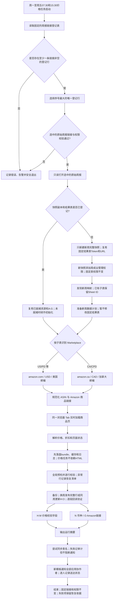

# SPEC: Amazon Daily 多站点价格校验、HTML 归档与飞书回写

> 状态：项目唯一事实来源（Single Source of Truth）。本文件同时记录“当前已实现基线”和明确标注的“下一阶段规格”；如需改变需求，先修改本文件，再在 `TASKS.md` 追加任务。

文档职责：

- `SPEC.md`：稳定需求、业务规则、架构、配置、操作、部署和验收标准。
- `TASKS.md`：有顺序、可验证的实施清单和完成历史。
- `REVIEWS.md`：当前评审中尚未采纳的临时意见；采纳后回写 SPEC/TASKS 并清空。

## 1. 目标与边界

### 2026-08-26运行可靠性修正（优先于历史HTML/手动换周口径）

- 正式`--weekly-run`与`--weekly-push-only`是独立价格任务：运行副本配置强制关闭HTML下载、归档门禁和HTML服务依赖，不改用户的独立HTML配置。Windows价格入口不启动HTML服务器；异常告警也不读取HTML服务。HTML单独命令和已有文件保持不动。
- 每次正式运行读登记表最大有效序号。未变化时复用本周快照，不刷新A:G；出现新序号时只自动创建原始周报完整快照，不新建结果Spreadsheet。所有周期共用固定结果Token `Epads8MQkhkuBctjl3lcqLUvnCg`及其现有链接；换周更新同一张表的数据和名字，已有子表复用Sheet ID。相同序号改源URL仍安全停止，要求登记新序号。
- 固定身份登记在`outputs/weekly_runs/fixed_result.json`，这是运行资源登记，不是新增配置来源，部署/迁移需随weekly manifests一起保留。登记缺失时自动换周停止，禁止新建替代表；各周manifest结果Token必须与它一致，历史周期缓存不得覆盖已切换到新周期的固定表。
- 换周先发现全部US/CA子表、审计链接、抓取并保存完整bundle，此时固定表仍展示原有数据。数据准备好后备份固定表，以完整A:P行块同时替换基础字段和价格字段（含清理旧尾行），而非先清空再等待抓取；回读验证后更新表名。新增业务子表才新增Sheet；不删除现有子表和权限。多子表更新不是云端原子事务，部分失败明确报告并保留备份/检查点。
- 新周子表列表和Marketplace由发现结果驱动，不以旧JSON子表名单截断；CPD使用CA配置。dry-run/fetch-only不创建周资源。初始化失败恢复同一generation及已保存Token，不重复复制已确认资源；OS文件锁随进程退出释放，`.locks`内标记文件存在不等于正在运行。
- 原始周报、登记表和完整快照永远只读。每次新快照仍添加周成业管理权限；固定结果表沿用已有协作者和访问权限，不新增结果表共享，不需要因换周重新授权。
- 抓取每个子表后先原子保存bundle，再进行飞书交付。无HTML列迁移先备份，将读取到的富文本链接转换为明确URL，再回读核对迁移内容；H:O每段最多200行，写前检查ASIN位置，写后核对ASIN和8个字段。只有回读验证通过的行计入写入成功。
- 结构/身份全局预检失败时禁止覆盖；备份、迁移、写入或回读失败按子表/范围记入阻断并继续其他安全范围。改名失败不影响已有数据、本地汇总或完成通知；不把计划中的新表名冒充实际表名。阻断行可能保留旧值，通知提醒核对时间戳。
- 每批`{run_id}_delivery.json`保存交付检查点和失败阶段；`{run_id}_weekly_bundle.json`是抓取恢复依据。仅完整无阻断交付后更新`outputs/weekly_runs/active_result.json`为已验收批次索引，其结果Token仍为固定值。旧周数据保存在已有bundle和本地备份中，不能把旧周期manifest当成仍展示旧周内容的云端表。
- 同run_id重试保留首次本地备份，避免用迁移后数据覆盖原备份。API跨子表不提供整体原子事务，发生部分失败会明确报告，禁止承诺全表瞬时切换或零失败。

### 2026-08-26生效变更：通知、结果表名与列布局

2026-08-26最终调度纠偏：每周一至周五北京时间07:30、15:30每天两次长期执行，无截止日期，周末不触发。`AmazonDaily_0730`和`AmazonDaily_1530`均启用，下一次分别为2026-08-27 07:30、2026-08-26 15:30；本次不立即补跑。`bin/schedule.ps1`重装同样创建这两个工作日任务。两个时段均采用固定结果表、无HTML列和分段全员通知。此规则取代此前“仅下午”的误解及历史8月31日截止日期，不改变历史验收记录。

从下一次正式写入生效，本次仅向周成业发送样式预览，不修改当前云端表格：

- A:G、H:M不变；N为币种、O为Amazon链接，删除HTML链接字段（固定A:O、八列结果）。本地HTML归档数据保留。对完全匹配旧A:P表头的系统结果表先备份，再单次写N:P将币种/Amazon链接左移并清空旧P；未知布局停止，不改原表/快照。迁移可幂等重试。
- 同一周继续复用独立结果表Token；成功写入后更名为`Amazon周报前端价格捕捉_{period_id}_{run_id}`，日期和时间与该批次一致，同时更新manifest。
- 完成通知首行`Hi，有个任务完成请查收.`，标题`Amazon 周报前端价格捕捉任务`；保留周期、run_id、起止时间、耗时、子表数、写入数和阻断数，正式全量保留技术异常率。去掉HTML端口行，`证据`改为`本地数据`；结果表提供名称和URL。
- 固定说明文档：<https://wit0jhu6kvu.feishu.cn/wiki/G531wP7WNiepV3krnrHcavqin6d>。模板唯一实现在`app/result_notification.py`，全量和缓存恢复共用，不另设重复配置。
- 通知采用分段富文本：问候、标题、运行时间、统计、链接各分组，耗时显示分秒，结果表和说明文档使用具名可点击链接。正式消息不含模拟提示，也不能使用虚构运行数据冒充已完成任务。
- `本地数据`行仅向周成业（现有`feishu_manager_open_id`）发送；其他协作者发送前移除整行，未配置管理员时默认全部隐藏。不新增重复配置；管理员失败告警仍可包含本地审计路径。
- 每次完成读取当前应用collaborators API，按Open ID去重通知所有应用协作者并包含周成业；不是文档分享名单或整个通讯录。单人失败继续发送其他人；应用可用范围不自动扩权。
- `{run_id}_notifications.json`逐人记录message_id或失败原因。名单读取失败仅通知周成业并记录未完成群发；未全部送达不得宣称全员成功，另外提醒周成业处理。

本节覆盖下文历史R1章节中旧A:P/N列HTML、仅通知周成业和完成通知带端口的口径；历史PoC/验收记录不改写。

本项目每日从飞书完整快照副本读取本周周报数据，实时抓取 Amazon 美国站与加拿大站商品页，计算实际成交价并与目标成交价比较，最后将筛选后的 A:G 基础字段和 H:O 八列结果写入程序创建的独立结果 Spreadsheet。

- 正式业务数据只来自实时 Amazon 页面，不使用本地 HTML 作为业务结果。
- 程序不自动切换 VPN/IP；US/CA 所需网络出口必须按 MarketplaceProfile 配置并记录。仅在配置显式填写 `proxy` 时使用代理。
- 原始周报和完整快照副本只读；独立结果 Spreadsheet 写入前必须先做本地备份。

### 1.1 端到端流程总览

> 维护要求：凡是影响数据来源、完整快照、独立结果表、子表范围、站点处理、抓取与归档顺序、列布局、风险拦截、写回或清理策略的需求变更，必须在修改本 SPEC 的同时更新本流程图；流程图未更新视为文档变更未完成。



流程图是规格总览，遇到细节冲突时以下文对应章节的字段定义、异常规则和验收标准为准。

## 2. 运行环境与依赖

- Windows，Python 3.10+
- DrissionPage 4.1.1.4
- openpyxl 3.1+
- httpx 0.24+
- 飞书自建应用需能读取源 Wiki/Spreadsheet、复制完整周报、创建 Spreadsheet/Sheet，并能编辑独立结果表

安装命令：

```powershell
python -m venv .venv
.venv\Scripts\python.exe -m pip install -r config\requirements.txt
```

## 3. 配置

配置按职责分成两条互不重叠的链路：

- 非敏感配置：代码默认值 → `config/config.json`。
- 敏感配置：根目录 `.env` 文件；兼容当前本机固定路径 `.env/飞书凭证.txt`；系统环境变量优先。

- 可提交模板：`config/config.example.json`
- 本机非敏感业务配置：`config/config.json`
- Secret 模板：`.env.example`
- 唯一敏感变量：`FS_APP_SECRET`

`config/config.json` 和 `config/config.example.json` 禁止出现 `feishu_app_secret`；程序检测到后必须启动失败。根目录 `.env` 不进入 Git。新增非敏感配置项时必须同步更新 `app/config.py`、`config/config.example.json`、本文件和相关测试；新增 Secret 时必须同步更新 `.env.example`、本文件、部署配置和脱敏测试。

## 4. 文件夹结构与职责

```text
amazon_daily_structured_20260821/
├── .env.example              # Secret变量名模板；复制为根目录 .env
├── .env                      # 标准本机 Secret 文件；当前本机也可为受控凭证目录，永不提交
├── .gitignore                # Git污染与敏感文件边界
├── README.md                 # 最短部署入口和主文档导航
├── 启动中心.bat              # Windows人工操作入口
├── app/                      # 正式业务源码（等价于常见项目的 src/）
│   ├── main.py               # CLI、流程编排、风险保护和写回决策
│   ├── config.py             # 配置加载、来源隔离与校验
│   ├── models.py             # 领域数据结构与页面状态
│   ├── pricing.py            # Decimal价格计算和优惠分类
│   ├── feishu.py             # 飞书读取、复制、备份与写回
│   ├── cache.py              # 快照、缓存和断点恢复
│   ├── exporters.py          # CSV等本地产物导出
│   ├── diagnostics.py        # 异常证据保存
│   └── amazon/
│       ├── crawler.py        # 浏览器、Marketplace上下文和重试
│       ├── parser.py         # HTML纯解析
│       └── selectors.py      # 页面选择器/正则规则
├── config/
│   ├── config.example.json   # 非敏感配置完整模板/字段清单
│   ├── config.json           # 当前非敏感运行配置
│   └── requirements.txt      # Python运行依赖
├── bin/                      # 部署、运行、验收和计划任务脚本
├── docs/
│   ├── SPEC.md               # 唯一事实来源
│   ├── TASKS.md              # 原子任务与验证进度
│   ├── REVIEWS.md            # 当前未采纳的临时评审
│   ├── README.md             # docs目录导航
│   ├── 操作手册.md           # 旧路径兼容，只跳转到SPEC
│   ├── 当前业务规则.md       # 旧路径兼容，只跳转到SPEC
│   └── 交付清单.md           # 旧路径兼容，只跳转到SPEC
├── tests/                    # 离线单元/流程测试；随代码共同演进
├── sandbox/                  # 最小PoC；除README外默认不提交
├── outputs/                  # 所有运行产物，自动创建且不进Git
├── data/                     # 本地原始/加工数据，不进Git
└── tmp/                      # 可随时清空的临时文件，不进Git
```

不得为追求目录形式将 `app/` 迁移为 `src/`。不得把运行产物写入 `app/`、`config/`、`docs/` 或 `tests/`。

### 4.1 docs 文件职责

| 文件 | 唯一职责 | 允许内容 | 禁止内容 |
|---|---|---|---|
| `SPEC.md` | 定义系统应当是什么 | 已实现事实、已确认需求、架构、Schema、配置、操作、部署、验收 | 任务打勾进度、未采纳的随手建议 |
| `TASKS.md` | 定义按什么顺序实施 | 原子任务、验证命令、完成状态、历史 Phase | 新业务口径全文、临时评审长文 |
| `REVIEWS.md` | 暂存当前评审意见 | 尚未决定是否采纳的问题、风险、备选方案 | 已确认规格、长期任务历史、操作手册 |
| `README.md` | docs导航 | 三份主文档用途和阅读顺序 | 复制业务规则 |
| 三份中文旧文件 | 旧链接兼容 | 指向对应 SPEC章节 | 新增任何独立规则 |

### 4.2 文档同步规则

任何代码修改完成前必须按变更类型同步文档：

| 变更类型 | 必须更新 |
|---|---|
| 新需求、业务规则、字段、数据布局或流程变化 | 先更新 `SPEC.md`，再在 `TASKS.md` 追加任务 |
| 新增/删除配置、环境变量、端口、路径 | `SPEC.md`、配置模板、相关测试；Secret另更新 `.env.example` |
| 实现任务或修复完成 | 更新 `TASKS.md` 状态和实际验证结果；实现与规格有差异时同时改 `SPEC.md` |
| 尚未决定的评审意见 | 写入 `REVIEWS.md`，不得直接实施 |
| 评审意见采纳 | 更新 `SPEC.md`、追加/修改 `TASKS.md`，然后从 `REVIEWS.md` 清除 |
| CLI、部署、Docker、定时任务或故障处理变化 | 更新 `SPEC.md` 第14、18、19节及根 README入口（如入口发生变化） |
| 目录结构或文档职责变化 | 更新本节和 `docs/README.md` |

提交前文档一致性检查属于 Definition of Done；未同步对应文档的代码变更不得标记 TASK 完成。

## 5. 数据结构

### ReportRow

核心字段：源行号、ASIN、SKU、尺寸、正常售价、周报折扣形式、周报折扣值、目标成交价及其来源。

目标成交价来源：`feishu_value`、`excel_cached_value`、`local_fallback`、`missing`。

### CrawlResult

页面状态：`ok`、`page_not_found`、`sold_out`、`crawl_error`、`parse_error`、`source_data_invalid`。

飞书固定八列结果：展示价格、折扣类型、折扣值、最终价格、一致性检查、时间戳、币种、Amazon链接。

### 独立结果 Spreadsheet 布局

- 表头：第 2 行；数据：第 3 行起。
- A:G：ASIN / SKU / 尺寸 / 正常售价 / 本周折扣形式 / 本周折扣值 / 目标成交价。
- H:O：固定八列结果。其中H:M为六个价格校验字段，N为币种、O为Amazon链接。

## 6. 核心业务规则

优惠分类只依据页面证据，优先级：`coupon > code > 价格折扣 > 原价调整`。周报类型只用于预期偏差诊断。

- 原价调整：最终价等于展示价；折扣值为目标成交价减正常售价。
- code：最终价为展示价乘以 `(1-code%)`。
- 价格折扣：展示价已是折后价，不重复扣减。
- coupon：明确最终价 > 展示价减 Saving 金额 > 展示价乘以 `(1-coupon%)`。
- 一致性：`abs(最终价 - 目标成交价) <= price_tolerance`，默认容差为同币种的 0.50 货币单位（US 为 USD，CA 为 CAD）。
- 金额计算使用 `Decimal` 和 `ROUND_HALF_UP`，保留两位小数。

促销证据必须来自当前 ASIN 的商品主价区、Buy Box 或 Amazon 对应的促销控件，禁止整页无锚点搜索：

- Coupon 百分比只接受 Coupon 控件的 `aria-label`、`couponText`、`couponLabelText`、`ct-coupon-tile` 等结构化证据；`Saving` 金额必须和该 Coupon 证据位于同一控件。
- Code 只接受购买区 alert/promotion 容器中的 `Save X% at checkout` 等文案。
- Save% 只接受主价格容器或 `priceToPay` 邻近的 savings 元素。
- 评论、问答、推荐商品、脚本模板中的 Coupon、Code、Saving、Save% 文案一律不得参与当前商品分类或计算。
- 页面同时存在真实 Coupon 与 Code 时仍按既定优先级选择 Coupon；只有评论等非当前商品证据被过滤，不改变页面真实促销优先级。

本节及后续扩展章节构成完整业务规则，不再依赖其他业务规则附件。

## 7. 主流程与安全保护

```text
读取完整快照副本 → 保存同批本地快照 → 创建或复用独立结果表 → 备份结果表 → 刷新 A:G/清空 H:P
→ 实时抓取 → 解析计算 → 保存缓存、CSV 与 HTML → 风险检查 → 写入 H:P
```

- 技术异常比例 `(crawl_error + parse_error) / 抓取数` 超过 10% 时默认不写 H:P。
- 目标成交价 `missing` 比例超过 10% 时默认不写 H:P。
- `source_data_invalid` 不进入抓取，但写入异常空结果，避免旧成功结果残留。
- `--force-push` 只能在人工确认后使用。
- 缓存仅在数据签名、Sheet、解析规则版本和有效期匹配时恢复。
- 促销选择器或计算口径变化必须递增解析规则版本，使旧缓存失效并重新解析/抓取。

### 临时交付模式（2026-08-25）

按交付优先级暂时关闭 HTML 新归档：`html_archive_enabled=false`、`html_archive_required=false`。正式批次继续抓取价格、折扣、币种和 Amazon 链接并写入飞书；HTML链接列允许为空，既有 HTML 文件保留且局域网服务可继续读取。恢复 HTML 下载时必须同时恢复归档开关和必需门禁，并重新进行小表验证后再全量。

## 8. CLI 与验证

常用入口：

```powershell
$env:PYTHONPATH='app'
.venv\Scripts\python.exe app\run.py --dry-run --sheets PD03
```

离线回归测试：

```powershell
$env:PYTHONPATH='app'
.venv\Scripts\python.exe -m unittest discover -s tests -v
```

任何业务修改至少需要新增或更新对应单元测试；涉及飞书写入或 Amazon 页面行为时，先 dry-run，再执行单 Sheet 验证，最后才允许全量运行。

## 9. 已知工程约束

- DrissionPage 使用一个 ChromiumPage；允许保留可重建 tab 的抽象，但初始每个 Marketplace 同时只能有一个活动商品 tab，禁止多浏览器或多活动 tab 并发。
- `outputs/`、`data/`、`tmp/`、本地 Secret 和虚拟环境禁止提交。
- 规格变更先更新本文件，再在 `TASKS.md` 追加 Phase R，不删除历史任务。

## 10. 规格变更：加拿大 CPD 与全量商品链接（2026-08-24）

> 本节是下一阶段实现基准。尚未通过 PoC 验证的参数标记为“待确认”，实现前不得凭猜测写死。

### 10.1 多站点模型

项目由“固定美国站”改为“按子表选择 Marketplace”。不得复制一套 CPD 爬虫；Amazon 页面解析、折扣计算、重试、缓存和飞书流程继续复用，站点差异由配置和请求上下文提供。

```text
Sheet → MarketplaceProfile → canonical product URL → browser locale setup
                                      ↓
                         共用抓取、解析、计算和归档流程
```

MarketplaceProfile 至少包含：

- `marketplace_id`：`US` / `CA`
- `domain`：美国 `www.amazon.com`；加拿大 `www.amazon.ca`
- `currency_code`：美国 `USD`；加拿大 `CAD`
- `postal_code`：美国默认 `90210`；加拿大邮编待 PoC 确认
- `language`：默认 `en_US` / `en_CA`，实际查询参数以页面 PoC 为准
- `sheet_patterns`：普通 PD/XD/PDF 子表映射 US；所有 `CPD*` 子表映射 CA

必须由统一函数构造商品标准链接，例如：

```text
US: https://www.amazon.com/dp/{ASIN}?language=en_US
CA: https://www.amazon.ca/dp/{ASIN}?language=en_CA
```

源表中的 ASIN 读取需支持纯 ASIN、Amazon 超链接文本和公式超链接。解析后保存两个独立字段：

- `asin`：规范化后的商品编号，用于缓存、匹配和命名。
- `product_url`：按 MarketplaceProfile 生成的标准商品链接，不信任源链接中的跟踪参数。

所有纳入配置的子表都必须生成 `product_url`；无法提取合法 ASIN 的行标记 `source_data_invalid`，不得访问不受信任域名。

R1.6 已实现的规范化边界（2026-08-24）：

- `MarketplaceProfile` 固定 US=`amazon.com/USD`、CA=`amazon.ca/CAD`；标准链接分别为 `https://www.amazon.com/dp/{ASIN}` 和 `https://www.amazon.ca/dp/{ASIN}`。
- 支持纯 ASIN、普通 URL、飞书富文本 `link/text`、列表富文本和公式 `HYPERLINK`；统一移除 ref、tag 和查询参数。
- 显式 URL 必须先校验精确 host；`amazon.com.evil.example`、非 Amazon 域名和 US/CA 跨站 URL 均拒绝。存在坏 URL 时禁止回退到显示文本中的 ASIN，防止绕过域名校验。
- 商品导航完成后先按明确标题识别 `Page Not Found`，再从最终 `/dp/{ASIN}` 或 `/gp/product/{ASIN}` URL 校验商品身份；明确404沿用 `page_not_found` 并归档，正常商品页跳转到不同变体/商品时标记 `identity_mismatch`，禁止解析、归档和写回该行价格。`?th=1`、`?psc=1` 等查询参数不参与身份比较。
- 以 `B0` 开头或包含 URL 但无法提取合法 ASIN 的值属于无效商品并阻断；ASIN 列下方的成本、广告、颜色、利润等普通业务标签记录为 `non_product_label` 并跳过，不伪装成商品错误。
- 正式快照实测生成 141 个 US 标准链接（PD03 112、PD63 29），无效商品 0，跳过非商品标签 62；本周 7 个 CPD 表为空，因此 CA 仅完成离线格式验证，真实加拿大页面验证属于 R1.7。

### 10.2 加拿大 CPD 请求上下文

CPD 必须使用 `amazon.ca`，并在抓取前为加拿大站建立独立浏览器上下文：

- 加拿大邮编 Cookie/地址设置必须只作用于 CA 上下文。
- US 与 CA 不共享站点 Cookie 初始化结果。
- 同一 Marketplace 使用“一个浏览器 + 一个活动商品 tab”；异常时可以关闭并重建 tab。是否允许 US/CA 共用一个 Chromium 实例，必须先通过 PoC 验证 Cookie 和区域隔离，但 US 与 CA 仍按顺序分批，不并发抓取。
- 优先实现按 Marketplace 分批运行：先完成 US，再初始化 CA 并处理 CPD，以降低区域状态串扰。
- VPN/出口地区要求必须可配置并记录日志；程序不能假设美国出口可以稳定返回加拿大本地价格。

#### Amazon 风控优先节奏

- 正式全量阶段每个 Marketplace 使用一个 Chromium 浏览器进程和 4 个互斥商品 Tab；四个 worker 各自独占一个 Tab，直到该商品解析、HTML 原子落盘与校验、以及归档后 1～3 秒等待全部完成才释放。禁止创建四个浏览器进程。
- 单个 ASIN 必须完成页面解析、自包含 HTML 生成、原子落盘、文件存在/大小/结构/哈希校验后，才进入下一商品等待阶段。
- 正常情况下，每个 Marketplace 在上一个 ASIN 归档校验完成后随机等待 `1～3` 秒，等待结束后才允许导航下一个 ASIN；禁止固定间隔。归档失败也不得立即跳转下一商品，至少执行相同等待；若同时属于连续技术失败或风控信号，则改用更长冷却。
- 新配置使用 `post_archive_delay_min=1.0`、`post_archive_delay_max=3.0`。旧 `delay_min/delay_max` 已从代码默认值、运行配置和配置模板移除，禁止恢复第二套抓取前延迟。
- `1～3` 秒属于 ASIN 之间的调度节奏，不计入前一个 ASIN 的处理 deadline，但必须计入批次总耗时和日志。
- 出现 Captcha、访问受限、HTTP 429/503 或连续技术失败时，受影响 Tab 进入随机 `60～180` 秒冷却并重建；批次仍受技术异常率写回门禁保护，异常恶化时停止该 Marketplace 并告警。
- 正式配置固定 `workers=4`。并发仅发生在同一浏览器的四个独立 Tab 内；不得继续放大到 5 个以上，除非先修改 SPEC 并完成新的风控验证。

加拿大 PoC 至少验证：CPD 样例 ASIN 可打开、区域设置生效、主价可解析、页面货币为 CAD、Coupon/Code/Save 规则与美国站是否兼容。

R1.7 已于 2026-08-24 完成单 ASIN 实网 PoC：`B0BN5CJFCX` 在 US 返回 `ok`/USD（20.467s），在 CA 返回 `ok`/CAD（21.392s）。Amazon.ca 地址弹窗使用 `M5V` 与 `3A8` 两段输入，导航栏实测可能省略邮编最后一位，因此仅 CA 允许以规范化前五位作为可见区域证据并记录 `visible_prefix5`；US 仍必须完整匹配。PoC 只验证页面与区域上下文，不写飞书、不生成 HTML，归档及归档后 1～3 秒等待留在 R1.9 同 tab 链路验证。

### 10.3 货币语义

`CrawlResult` 和 CSV 增加 `currency_code`，不得再由折扣文本推断为固定 USD。

- US 结果使用 `USD`，CPD 结果使用 `CAD`。
- 展示价格、正常售价、目标成交价和最终价格必须属于同一 Marketplace 货币后才能做一致性比较。
- 本阶段不进行 USD/CAD 汇率换算；若 CPD 周报目标价不是 CAD，必须停止该行比较并标记数据风险。
- 飞书金额仍写数值，并由固定 O 列 `币种` 明确标记 `USD` 或 `CAD`；布局预检只验证列是否可安全使用，不再改变 N:P 已确认列位。
- CSV 的 `discount_unit` 必须输出 `%`、`USD` 或 `CAD`，不能固定写 USD。

R1.8 已于 2026-08-24 完成币种传播与保护：模型缺省币种为空而非隐式 USD；只有 US/USD、CA/CAD 组合进入一致性比较。未知或错误组合使用 `currency_error`，保留页面解析结果，但固定输出 `match=-`、`price_diff=null` 且不做汇率换算。缓存最初在 R1.8 升级为 schema 3，R1.9 正式归档接入后再升级为 schema 4；CSV、缓存 manifest、每日日志摘要和周 manifest 均携带币种信息。旧 schema 缓存不再复用。飞书 O 列写入属于 R1.14，届时只允许 `USD`、`CAD` 或明确空值。

### 10.4 飞书子表与目标布局

- 源子表路由和独立结果子表创建清单加入全部 `CPD*` 子表；实际名称必须通过飞书只读 API 枚举后写入配置，不能仅猜测名称。
- CPD 与现有子表使用相同的源数据读取、A:G 同步、无效行保护、缓存和写回流程。
- 目标规格固定为 A:P；R1.14 必须将当前只支持 A:M 的旧写入器升级为 A:P，新创建的结果子表从首次初始化起直接采用 A:P，不对新表执行历史列迁移。
- H:P 为固定九列结果；H:M 的六个价格校验字段保持现有顺序和语义不变。
- N 列新增 `HTML链接`，写入该 ASIN 本次归档 HTML 的本机 `file:///` URL。
- 正式局域网服务启用后，N 列改写为 `http://<本机局域网IP>:8765/<访问Token>/<日期>/<run_id>/<Sheet>/<文件>.html`；服务根固定为整个 `htmls`，新日期和新批次自动可访问，不为每个文件夹重复开端口。服务只读、屏蔽隐藏路径、监听 `0.0.0.0:8765`，Windows 防火墙仅允许 Private 网络入站，并在用户登录时自动启动。
- O 列新增 `币种`，US 写 `USD`，CPD/CA 写 `CAD`；币种未知时不得执行价格一致性比较。
- P 列新增 `Amazon链接`，写入按 MarketplaceProfile 生成并实际用于抓取的标准商品 URL。
- N:P 是九列结果中的三个新增字段，必须与同一 ASIN、同一 run_id 的 H:M 价格校验字段共同写入，禁止跨批次拼接。
- `push-only` 必须使用缓存中与该 run_id 对应的本机 HTML 文件 URL、币种和 Amazon URL；归档不存在时 N 列写空值并记录原因，不生成失效链接。

首次实施写入前必须运行飞书布局只读预检，确认所有 US/CA 独立结果子表均为固定 A:P 布局且 H:P 表头一致。N:P 出现非本系统业务数据或表头不匹配时必须停止并修正/重建结果子表，不得临时改变已确认的 N、O、P 列位。

R1.5 正式快照发现结果（2026-08-24）：

- 正式快照共 19 个子表；18 个业务子表必须保留一对一结果映射，唯一排除项为辅助表 `BI源数据`。
- US 11 表：`PD03`、`PD17`、`PD05`、`PD25`、`XD03`、`XD17`、`PD52`、`PD39`、`PD33`、`PDF075`、`PD63`。
- CA 7 表：`CPD03`、`CPD17`、`CPD05`、`CPD25`、`CPD39`、`CPD33`、`CPD52`。
- 当前周 `PD03` 的 ASIN列区域非空154项，其中商品112、非商品业务标签42；`PD63` 非空49项，其中商品29、非商品业务标签20。商品链接的最终判定由 R1.6 完成，不得把整列所有非空值当作商品。
- 其余 16 个业务表为完整容量扫描后确认的空模板。空业务表仍保留 Marketplace 和同名结果映射，状态为 `mapped_empty`，不生成虚假行。
- 已确认标准源字段位于第 2 行：`ASIN/SKU/颜色/尺寸/正常售价/上周折扣形式/上周折扣%/本周折扣形式/本周折扣%/广告策略/目标成交价/...`。A:G 输出字段仍按 `ASIN、SKU、尺寸、正常售价、本周折扣形式、本周折扣值、目标成交价` 选择，不包含颜色和辅助销量字段。
- `sheet_profiles` 是配置中唯一 Marketplace 路由表，必须与 `sheets` 18 个名称一一对应；新增、删除或重命名子表必须重新运行发现，未知的含数据业务表会阻断。

2026-08-25 `seq-2` 更新周报实测：19 个源子表中映射 18 个业务子表（US 11、CA 7），共识别 725 个有效商品链接、无效链接 0；独立结果表已同步 18 个 A:G 子表共 725 行并逐表回读。飞书 batch values 返回的 range 前缀可能是标题而非 sheet_id，子表表头发现固定改为逐 Sheet 的前10行读取，禁止再用 batch 返回键直接归属。

正式全量和缓存恢复完成后按第1节通知全部应用协作者，并逐人记录送达。周成业由`feishu_manager_open_id`保证包含；数据写入成功与通知全员送达分别记录。

通知频率以完整批次为单位：每位协作者每批发送一次汇总，含本地数据及说明文档，无端口行。中间子表及只读发现/审计/PoC/dry-run不群发；运行或投递问题另通知周成业。

## 11. 页面离线全量归档

### 11.1 数据来源与时序

参考样例目录 `D:\projects\amz-save-test\htmls` 的已验证特征：588 个 ASIN `.html` 文件，总计约 1.525GB、平均约 2.66MB；文件是标准 `<!DOCTYPE html>` Amazon DOM。抽样文件仍包含数千个 HTTPS外链，因此格式和页面内容符合参考，但原样文件本身不满足完全离线。

正式归档只长期保留一个自包含 `.html`：将当前页面及其 CSS、图片、字体、iframe等资源封装为单文件，作为用户离线还原文件和飞书 N列目标。解析阶段仍在内存中使用原始 `tab.html`，但不再额外落盘 `.raw.html`；其 SHA-256和必要诊断元数据写入 manifest，用于证明解析输入。

自包含 HTML优先在同一个已加载 tab 中使用 SingleFile类页面封装能力生成，保留普通 `.html` 扩展名和 Amazon页面主体结构。Chromium MHTML捕获作为 PoC对照或失败回退，不作为用户默认打开格式。禁止默认启动第二个浏览器或再次导航同一 Amazon URL。

推荐流水线：

```text
加载页面 → 必要的受控懒加载处理
→ 复制一次 tab.html 用于解析并计算内存哈希
→ 同 tab 生成自包含离线 HTML
→ 单个 HTML原子落盘并校验
→ 生成指向已落盘文件的本机 `file:///` URL
```

解析输入与封装输入必须来自同一个 tab和同一页面状态；允许补取页面已声明但尚未缓存的资源，但不得再次导航商品 URL。磁盘写入即使使用后台工作线程，Marketplace 调度器也必须等待该文件原子落盘和完整性校验返回成功，再开始 `1～3` 秒随机等待；等待结束前不得导航下一个 ASIN。

2026-08-24 SingleFile CLI预试验：使用 US ASIN `B0BN5CJFCX` 独立捕获两次，耗时约 17.8秒和11.8秒；两次均在 `Runtime.evaluate` 阶段出现 DevTools连接关闭，CLI返回码为0但没有生成文件。结论：不得把独立 CLI或退出码作为正式成功判据；优先将封装逻辑接入现有 DrissionPage tab。成功必须同时满足文件存在、超过合理最小字节数、包含合法 HTML结构和目标 ASIN、哈希可读以及离线检查通过。

2026-08-24 同 tab 改进 PoC：固定官方 `single-file-cli@2.1.3`，商品导航前注入 hook，解析后在当前 tab 内生成 Blob 并下载，CDP 只接收小状态对象。正常商品 US 归档 54,432,503 bytes/15.202s，CA 归档 14,936,737 bytes/8.672s；两者均完成原子落盘、SHA-256、ASIN/结构校验，且断网 Chromium 中标题、价格和主要图片可见，HTTP(S)资源条目为0。真实 `page_not_found` 样例两站也完成归档与断网校验；404 使用10KB最小体积，其他状态仍使用100KB。`data-src` 等不会主动加载的惰性元数据可以保留；离线门只阻断真实 `src/srcset/poster/stylesheet/CSS url()` 外部资源。当前每站覆盖正常与404两种状态，尚缺真实售罄状态及P50/P95 Gate。

阶段性能统计采用最近秩：US 9份样本归档耗时P50/P95为9.420s/15.202s，体积P50/P95为32,819,003/57,924,629 bytes；CA 4份样本为7.780s/9.047s与14,712,749/14,936,737 bytes。该样本不足且无真实售罄，不用于最终生产 deadline。Amazon自定义播放器可能在非标准元素保留 `poster` 外链；页面业务解析完成后允许在归档前移除所有 `poster` 属性，商品主图、价格和正文不得删除，其他活动外链仍必须阻断。

`sold_out` 是随时间、邮编和 Marketplace 变化的外部状态。公开不可售候选在2026-08-24当前实测均已恢复为正常页面，因此不得为了满足测试数量修改页面、用历史文案或把404当作售罄。停止无上限候选探测；后续最小子表及一周稳定运行首次自然出现真实售罄时，必须自动保留抓取结果、归档 manifest 与断网验收证据，再完成该状态 Gate。

#### 离线完整性标准

“完全离线还原”在本项目中的验收定义为：

- 断开网络后，使用普通 Chromium浏览器直接打开 `.html` 主文件。
- 商品标题、ASIN、主价格、Coupon/Code/Save文案、主要图片和抓取时可见的核心布局能够显示。
- 打开与查看过程中不需要向 Amazon或第三方域名请求资源。
- 快照文件哈希与 manifest 一致，且能被标准 HTML解析器读取。
- 不要求登录态操作、加入购物车、视频播放、实时推荐、动态接口刷新或跳转链接继续离线可用；这些依赖服务端状态，无法作为静态快照保证。

PoC 必须在 US 与 CA 各选择至少三种页面状态进行断网验收，并记录自包含 HTML额外资源请求、处理时间、文件大小和失败原因。MHTML作为对照回退格式；不允许仅凭 `.html` 扩展名认定“完全离线”。

为了加载懒加载资源，可在同一个 tab 中执行有上限的分段滚动和短等待；总过程仍受单 ASIN deadline 控制。不得无限滚动，也不得点击购买、登录、广告或推荐链接。

#### 单个 tab / ASIN 时间预算

每个 ASIN 使用一个跨全部尝试的绝对截止时间。当前 `per_asin_timeout=90` 秒仅是旧解析基线；加入可能耗时 30～60 秒的自包含 HTML 后，R1.9 必须用实测 P95 重新确定总预算，禁止继续无验证地沿用 90 秒。不得把每次加载、元素等待、归档和重试的超时简单相加后突破新总预算。

建议阶段预算：

| 阶段 | 单次上限 | 说明 |
|---|---:|---|
| 获取 tab | 5 秒 | 池中无可用 tab 时等待；该时间单独记录为排队时间 |
| 页面导航/文档加载 | 30 秒 | 实际超时取 `min(page_timeout, 剩余总预算)` |
| 价格元素等待 | 12 秒 | 实际超时取 `min(price_wait_timeout, 剩余总预算)` |
| 页面稳定与促销内容读取 | 3 秒 | 只做短暂稳定，不使用固定长睡眠 |
| `tab.html` 复制与解析 | 5 秒 | 生成解析输入及内存 SHA-256，不单独落盘 |
| 离线 HTML封装与落盘校验 | 初始观测范围 30～60 秒 | 同 tab 内嵌资源、原子落盘并校验；正式上限由 R1.9 实测 P95 决定 |
| 商品间风控等待 | 随机 1～3 秒 | 在归档校验成功后执行，不计入前一个 ASIN deadline，但计入批次耗时 |

控制规则：

- `deadline = monotonic_start + per_asin_timeout`，所有阶段和重试只使用 `deadline - monotonic_now` 的剩余时间。
- 首次加载成功并取得 HTML 后不得为归档再次刷新或访问页面。
- 404 不重试；售罄最多刷新确认一次；parse_error 最多刷新一次；crawl_error 按配置重试，但只有剩余时间足够完成一次最小尝试时才启动。
- Captcha/断开连接时关闭并重建当前 tab；新 tab 仍继承同一个 ASIN 的原始 deadline，不能重新获得 90 秒。
- 底层调用超过阶段截止时间时尝试停止加载并关闭异常 tab；该 tab 不得归还空闲池，必须重建。
- 总预算耗尽后结果标记 `crawl_error`，错误原因包含耗尽阶段、尝试次数和各阶段耗时；不得标记售罄。
- `duration_ms` 记录 ASIN 页面处理到归档校验完成的时间；另记录 `navigation_ms`、`wait_price_ms`、`parse_ms`、`archive_ms`、`post_archive_delay_ms` 和 `risk_cooldown_ms`，用于后续调优。
- 自包含 HTML 必须完整落盘并通过校验；随后执行随机 `1～3` 秒等待，等待完成后才释放当前 Marketplace 执行槽并导航下一个 ASIN。
- 正式每个 Marketplace 固定一个浏览器、四个活动商品 Tab。Tab 池必须保证同一 Tab 不会被两个 worker 同时获取，异常重建的 Tab 在归还前也不得暴露给其他 worker。

首轮 PoC 必须统计 US/CA 各自的 P50、P95、超时率和 Captcha率，再决定是否将 CA 的 `per_asin_timeout` 单独提高。未经数据验证不得用无限延长超时掩盖站点问题。

每日运行两次由计划任务触发，每次生成独立 `run_id`。如果以后需要只归档不写飞书，应增加显式 `--archive-only` 模式，不与正常价格解析任务隐式并发。

### 11.2 目录和命名

归档根目录使用独立、可配置的本地目录，不放入代码仓库。配置项暂定为 `html_archive_root`。

当前本机配置为 `D:\projects\amazon_daily_structured_20260821\htmls`，并由 `.gitignore` 排除；部署到其他机器必须改配置，不得依赖该绝对路径。配套配置为 `html_archive_enabled=true`、`html_retention_days=5`、`html_min_free_gb=40.0`、`html_archive_required=true`。`html_archive_enabled=false` 只允许离线单元测试或明确的诊断运行，正式每日批次必须为 true。

Windows示例：

```text
D:\projects\amz-save-test\htmls
```

该路径只是部署示例，不能硬编码进业务代码；不同机器通过 `config/config.json` 或 Docker卷配置实际路径。程序只允许在解析并校验后的 `html_archive_root` 内创建、写入和清理文件。

```text
D:\projects\amz-save-test\htmls\
└── YYYY-MM-DD/
    └── {run_id}/
        ├── manifest.json
        ├── 001_PD03/
        │   ├── 00001_B0XXXXXXXX.html
        │   └── 00002_B0YYYYYYYY.html
        └── 012_CPD03/
            └── 00001_B0ZZZZZZZZ.html
```

- Sheet 目录前缀按配置顺序生成三位序号。
- HTML 文件前缀按该 Sheet 源数据顺序生成五位序号，随后是清理后的 ASIN。
- 所有路径片段必须白名单清洗，禁止 `..`、斜杠和任意路径注入。
- 写入先使用同目录临时文件，完成后原子重命名为 `.html`。
- `manifest.json` 至少记录 run_id、抓取时间、Sheet、源行号、ASIN、Marketplace、币种、Amazon URL、离线HTML相对路径和字节数、原始解析HTML SHA-256、最终文件 SHA-256、封装器版本、额外资源请求统计、离线验收状态和本机文件 URL。

### 11.3 保留和容量保护

- 保留最近五个自然日的数据，而不是简单保留五个批次；每天两次预计保留十个批次。
- 参考样例原始 DOM批次约 1.525GB/588页；自包含 HTML会内嵌资源，正式体积必须重新实测。若按用户估算 2GB/批、每天两批、五天计算，最低数据量为 20GB；在 PoC完成前部署盘建议至少预留 40GB，并以实测单批 P95体积乘以 10 个批次再加 50% 临时/安全余量确定最终容量。
- 每次运行开始和结束时执行清理；只删除 `html_archive_root` 下日期可解析且早于保留边界的目录。
- 删除前必须校验解析后的绝对路径仍在配置的归档根目录内，不跟随符号链接/目录联接越界。
- 磁盘空间检查必须针对 `html_archive_root` 所在卷，而不是项目代码所在卷。配置 `html_min_free_gb`；可用空间不足时停止归档并告警，但价格抓取是否继续由 `html_archive_required` 决定。
- 默认 `html_archive_required=true`：任一行的普通 HTML 捕获、原子落盘、ASIN 身份、SHA-256、活动外部资源或离线验收失败时，禁止写入该行整组 H:P，不能只留下空 N 列后继续写价格。MHTML 只保留为诊断证据，不得替代 N 列普通 `.html` URL；其他已完整通过的行可继续同批写回，并在摘要中明确记录被阻断行。
- 全量采用逐行收口而非整批零写入：即使批次技术异常率超过告警阈值，所有通过 ASIN 身份、币种、HTML归档和同批 run_id 门禁的行仍必须写入并回读；失败行单独阻断并生成恢复清单。最终状态使用“完成”或“部分完成（需恢复）”，通知必须包含写入数、阻断数、结果表和证据位置。

归档文件仅用于证据查看和离线还原，禁止在后续正式价格任务中作为替代数据源。

## 12. HTML 本机文件 URL

- `html_local_path`：自包含离线 HTML 的真实 Windows 文件路径。
- `html_file_url`：由真实路径转换得到并写入飞书 N 列的 `file:///` URL。
- 示例：`D:\projects\amz-save-test\htmls\2026-08-24\run_01\001_PD03\00001_B0XXXXXXXX.html` 转换为 `file:///D:/projects/amz-save-test/htmls/2026-08-24/run_01/001_PD03/00001_B0XXXXXXXX.html`。
- URL 必须由已完成原子写入且确认存在的文件生成；路径片段需进行 URL 编码，但盘符和目录层级保持可辨认。
- 不启动 HTTP(S) 静态服务，不开放本机端口，不配置公网 IP、域名、证书、反向代理、隧道或对象存储。
- 该链接只保证在能够访问相同本机路径的 Windows 电脑上使用；其他电脑、飞书移动端和云端预览无法访问属于预期限制。
- 若飞书不允许直接点击 `file:///` 链接，则 N 列仍保存完整 URL 文本，用户复制到本机浏览器或资源管理器打开；PoC 必须记录飞书桌面端的实际行为。

实现门要求 URL 只能由归档根目录内已经存在的普通 `.html` 文件生成；文件不存在、扩展名错误、路径越界或经过符号链接/Junction 越界时必须拒绝。URL 使用标准 URI 编码，中文、空格和 `#` 等不得原样造成路径歧义。

## 13. 日志与每日运行记录

当前已有：

- `outputs/logs/`：文本运行日志，默认保留最近 30 个文件。
- `outputs/daily_runs/YYYY-MM-DD/`：每次任务 JSON 摘要。
- `outputs/csv/`：逐行诊断结果。

新阶段在保留现有兼容性的基础上增强：

- 每个 run_id 必须贯穿文本日志、快照、缓存、CSV、HTML manifest、目标备份和每日摘要。
- 每日摘要增加 US/CA 分站统计、币种、归档成功/失败数、归档字节数、本机文件 URL 数、清理结果、磁盘剩余空间和飞书写入结果。
- 日志必须记录任务开始/结束、运行参数、配置摘要（Secret 脱敏）、各 Sheet 行数、页面状态、重试、异常比例、HTML 错误和清理动作。
- 日志严禁记录 App Secret、tenant access token、Cookie 或完整 Authorization 头。
- 文本日志留存策略从“文件数量”升级为可配置的天数；默认至少 30 天。HTML 仍只保留五天。

## 14. Docker 部署目标

Docker 仅作为最后部署阶段。开始 Docker PoC 前，本机版本必须连续完成至少七个自然日、每天两次、合计至少 14 个全量计划时段；每个时段均覆盖已配置 US/CA 子表、独立结果表写回、HTML归档、五日清理和日志。验收周内还必须完成至少一次受控失败恢复演练；真实失败或演练失败必须修复并补跑，只有 14 个计划时段最终均对应一个可审计的成功 run_id 后才通过门槛。

只需要 `worker` 容器：Python + Chromium/DrissionPage，执行定时抓取、计算和归档；不部署 `html-server`。

共享持久卷至少包括 HTML 归档和 `outputs`；Secret 通过 Docker secret 或运行时环境变量注入，不写入镜像或 compose 文件。容器需要健康检查、时区 `Asia/Shanghai`、日志轮转和可重复构建的依赖版本。

达到上述一周本机稳定性门槛后，Docker PoC 才验证：DrissionPage/Chromium 无头启动、中文路径或替代挂载路径、CA/US 网络出口、2GB 级批次落盘、计划任务重启恢复、容器升级不丢归档、容器路径能够稳定转换为实际 Windows 宿主机 `file:///` URL。

## 15. Secret 状态

代码和非敏感配置中能看到飞书 App ID：`cli_aa097133e3355ccd`。真实 App Secret 只允许来自根目录 `.env` 文件、当前本机固定的 `.env/飞书凭证.txt` 或系统环境变量 `FS_APP_SECRET`；系统环境变量优先。兼容凭证文件必须恰好为两个非空行，App ID 必须与 JSON 配置一致，否则启动失败。任何后续提交前必须继续执行 Secret 扫描。

## 16. 每周周报、完整快照副本与独立结果表（2026-08-24）

### 16.1 业务前提

原始周报链接每周会变化，不能再把某一个固定 Wiki/Spreadsheet Token 当作长期数据源。程序必须将“完整快照副本”和“独立结果 Spreadsheet”分开：原表与完整副本均不承载结果写回，所有筛选后的基础字段和价格结果只写入程序另行创建的独立结果 Spreadsheet。

本周原始周报：

```text
https://wit0jhu6kvu.feishu.cn/sheets/FPLxsRdvmhnbYDtZhTCcpsYjnSc?sheet=0GudVD
```

解析结果：

- URL 类型：飞书电子表格直链 `/sheets/{spreadsheet_token}`，不是 Wiki 链接。
- 原始 Spreadsheet Token：`FPLxsRdvmhnbYDtZhTCcpsYjnSc`。
- 链接当前定位的 Sheet ID：`0GudVD`；这只表示打开时选中的子表，完整任务仍需枚举工作簿内全部目标子表。

该链接属于每周运行输入，不应永久写死在业务代码中。后续新周报只登记到第 16.6 节的固定链接登记表，并在运行日志/manifest 中保存脱敏后的来源标识；普通每日任务不得以 CLI 参数或另一份配置绕过登记表选择规则。

### 16.2 强制三表分离流程

```text
从固定链接登记表选择本周周报链接
→ 解析并验证飞书域名、Spreadsheet Token 和访问权限
→ 读取原表元数据与子表清单（只读）
→ 在飞书云端创建完整快照副本
→ 校验快照副本的子表、行列和关键表头
→ 通过飞书 API 创建独立结果 Spreadsheet
→ 将配置的人工管理员以 full_access 授予快照副本和独立结果表
→ 在结果 Spreadsheet 中创建所需结果子表和 A:P 表头
→ 将原表、快照副本、结果 Spreadsheet 和结果 Sheet ID 固化到 weekly manifest
→ 后续业务读取基于同一快照副本
→ 从快照副本筛选最终需要的行列并写入结果表 A:G
→ 所有计算与追加结果只写入独立结果表 H:P
```

强制规则：

- 禁止对用户提供的原始周报执行任何写入、清空、迁移、追加列或格式修改。
- 创建副本之前不得启动 Amazon 抓取，避免产生无法关联到稳定工作簿的数据。
- 快照副本创建后必须重新读取其 Spreadsheet Token，不能继续使用原表 Token。
- 复制失败、复制结果不可访问或副本结构校验失败时，整次任务立即停止。
- 完整快照副本创建后默认只读；程序不得在其中清空、迁移、追加列或写入计算结果。
- 独立结果 Spreadsheet 必须通过飞书 API 创建，形态参考 `https://wit0jhu6kvu.feishu.cn/wiki/JbiQwDZXeiJan0k8ydRczfWNnFc`，但不得将该参考链接永久当作每周结果表。
- 应用身份创建或复用完整快照和独立结果表时，必须幂等将`feishu_manager_open_id`对应的人工账号授予容器级`full_access`。缺少配置、授权接口失败或回查不一致时，weekly manifest不得进入ready，也不得启动Amazon。人工管理员可处理文档阅读/编辑申请和协作者管理；企业级分享限制仍服从飞书管理后台策略。
- 每周只创建一个快照副本和一个结果 Spreadsheet；同一周任务重跑或每日两次运行必须复用 manifest 中登记的两者。
- 必须提供显式 `--new-week` 或等价初始化动作创建快照副本、结果 Spreadsheet 和结果子表；普通每日任务只接受已完成初始化的周期。
- 如果用户确实需要重建，必须使用显式 `--recreate-weekly-assets --confirm`，保留旧资源记录且不自动删除。

R1.2 实测接口与行为（2026-08-24）：

- 当前登记行解析到底层 `sheet` Token `WDOHs...ZnKL`，共有 19 个子表；旧的手工周报链接不再覆盖登记表选择结果。
- 完整复制调用 `POST /open-apis/drive/v1/files/{file_token}/copy`，请求 `type=sheet`、测试名称和空 `folder_token`；空目录表示应用 Drive 根目录。
- 大型 Spreadsheet 的 v3 子表查询可能返回 HTTP 500 或超时，结构发现必须回退到 `GET /sheets/v2/spreadsheets/{token}/metainfo`，关键区域使用 values batch API 分批读取。
- 复制接口返回 Token 后，副本可能暂时返回 `server error`；必须保存本地 pending 记录并有限退避轮询，直到结构可读后才能登记为成功。不得因就绪延迟再次创建副本。
- 本次唯一 TEST 副本为 `RMWPs...7nIh`，19 个子表；原表复制前后结构、行列容量及每表 `A1:P10` 与副本一致，结构 SHA256 为 `691d1b608dfa22b8ef4207bc5c4feabd2f0e089b9b642135c8a366a4ad2c1837`。

R1.3 实测接口与行为（2026-08-24）：

- 独立结果表使用 `POST /open-apis/sheets/v3/spreadsheets` 创建在应用 Drive 根目录；名称以 `TEST_独立结果表_` 开头，与原周报、完整快照副本和参考结果表 Token 均分离。
- 结果子表使用 `POST /open-apis/sheets/v2/spreadsheets/{token}/sheets_batch_update` 创建；测试子表固定名为 `TEST_RESULT`。
- PoC 只在新建结果表的 `TEST_RESULT!A2:P2` 写入 16 列固定表头并回读校验，不向参考表、原周报或快照副本写入。
- 本次 TEST 结果 Spreadsheet 为 `Ab0ws...Gnk3`，结果 Sheet ID 为 `2EwDSg`；A:P 回读一致，单次表头写入 0.390s，总耗时 4.641s。

R1.4 每周资源生命周期实测（2026-08-24）：

- 正式初始化命令为 `--new-week --confirm`；固定登记表当前周期 `seq-1` 首次创建 generation 1，正式快照 `GQJgs...Fnec`、正式独立结果表 `UWLds...AnNf`，耗时 15.859s。
- 第二次执行相同命令先只读校验 manifest、快照和结果表，返回 `reused=true` 并复用相同 Token，耗时 10.641s，未创建重复资源。
- manifest 使用临时文件加 `os.replace` 原子写入；周期锁使用独占创建的 `.locks/{period}.lock`，同周期并发初始化必须有且仅有一个成功进入创建阶段。
- `access_policy` 固定登记表、原表和完整快照为 `readonly`，独立结果表为 `readwrite`；写入保护只接受 manifest 当前 generation 的结果 Spreadsheet Token。
- `human_manager`记录人工管理员Open ID、`full_access`及快照/结果表的授权或复用证据；Open ID不是Secret，但必须显式配置，禁止从多人协作者列表猜测。
- `--recreate-weekly-assets --confirm` 创建下一 generation，并把上一 generation 的快照与结果表完整移入 `history`；不删除旧云端资源。该路径仅做离线模拟验证，未在真实飞书重复创建资源。
- manifest 不保存 App Secret、tenant access token、Cookie；正式完整 Token 只保存在本机 manifest，控制台和文档默认脱敏。

### 16.3 副本命名与登记

建议资源名称：

```text
Amazon周报_YYYY-Www_完整快照_YYYYMMDD
Amazon价格校验_YYYY-Www_结果表_YYYYMMDD
```

本地登记文件建议为：

```text
outputs/weekly_runs/YYYY-Www/weekly_manifest.json
```

至少记录：

- ISO 周、创建时间和创建者动作。
- 原始表 URL、原始 Spreadsheet Token、原始文件名。
- 完整快照副本 URL、Spreadsheet Token、飞书 file token/父目录（如 API 返回）。
- 独立结果 Spreadsheet URL、Spreadsheet Token、Wiki Node Token（如创建后挂入 Wiki）和父目录。
- 每个结果子表的名称、Sheet ID、来源子表、筛选规则、字段映射和 A:P 表头版本。
- 原始表、快照副本和结果表的子表清单及关键表头校验结果。
- 本周 Marketplace/Sheet 路由。
- 每日两个 run_id，以及各自抓取、HTML归档和写回状态。

Manifest 不得记录 App Secret、tenant token 或 Cookie。

### 16.4 链接解析兼容性

飞书资源解析层必须统一支持：

- `/wiki/{node_token}`：解析 Wiki 节点后取得实际对象。
- `/sheets/{spreadsheet_token}`：直接使用 Spreadsheet Token。
- URL 中的 `?sheet={sheet_id}`：仅作为当前定位信息，不用于代替全工作簿枚举。

只接受配置允许的飞书域名；Token 必须通过字符白名单解析，禁止把任意 URL 直接拼接进 API 路径。

### 16.5 与现有目标表设计的关系

此前“固定源表 + 固定目标表”的实现需要调整为“每周原表 + 完整快照副本 + 独立结果 Spreadsheet”：

- 原表：用户每周提供，只读且永久不修改。
- 完整快照副本：程序按周创建，完整保留原始周报，本周所有每日任务从它读取，但不写入。
- 独立结果 Spreadsheet：程序按周创建类似参考目标表的独立电子表格，并按配置创建所需结果子表；它只接收业务需要的数据，不复制原周报全部字段。
- A:G：从完整快照副本按子表路由、有效行规则和字段映射筛选整理后写入结果子表。
- H:P：在相同结果子表中写入九列计算结果，其中 H:M 为价格校验字段，N:P 为 HTML链接、币种、Amazon链接。
- 本地备份：每次修改独立结果 Spreadsheet 前保留 `outputs/target_backups/{run_id}` 备份；完整快照副本是原始数据保护层，不能代替结果表写前备份。

飞书应用必须同时具备读取原表、复制文件、创建 Spreadsheet、创建 Sheet 以及编辑独立结果表的权限；所需准确权限范围和 API 参数必须通过 R1.1～R1.3 PoC 验证后写回本 SPEC。

### 16.6 固定周报链接登记表（控制表）

采用一张固定飞书 Spreadsheet/Sheet 作为“周报链接登记表”。其地址属于长期部署配置；每周变化的原始周报链接只登记在该表中，不再修改 `config.json` 或业务代码。

固定登记表入口（用户于 2026-08-24 提供）：

```text
https://wit0jhu6kvu.feishu.cn/wiki/HwxpwCnZ7iV1o5klIGbc8wJHnrd
```

- URL 类型：飞书 Wiki 节点链接。
- Wiki Node Token：`HwxpwCnZ7iV1o5klIGbc8wJHnrd`。
- 2026-08-24 只读发现：底层工作簿仅有一个子表 `Sheet1`，Sheet ID 为 `c1fcd1`；表头为 `序号 / 飞书链接 / 更新时间`。
- 程序必须通过飞书只读 API 解析该节点实际指向的资源类型和资源 Token，再读取其中的登记表。
- 底层 Spreadsheet Token 仍由 Wiki API 动态解析，不在日志中完整输出；已验证 Sheet ID 固化到非敏感配置，若结构变化则只读预检必须停止。

每次普通任务启动顺序调整为：

```text
读取固定登记表（只读取有效登记行）
→ 按确定性规则选择唯一当前周报
→ 校验原表 URL 与权限
→ 查询该周是否已有完整快照副本和独立结果 Spreadsheet
→ 两者均存在则校验并复用；缺少任一资源则按初始化流程创建
→ 才允许进入抓取、归档和写回
```

登记表实际字段（2026-08-24 只读发现）：

| 字段 | 必填 | 说明 |
|---|---:|---|
| `序号` | 是 | 正整数且唯一；数值越大表示越新的周报记录 |
| `飞书链接` | 是 | Wiki 富文本/mention 或普通 URL；程序提取其中真实链接 |
| `更新时间` | 否 | 当前表中是公式；只用于人工查看和审计，不参与程序排序 |

最新周报选择规则必须确定且可审计：

1. 忽略 `飞书链接` 为空的预留行；其公式更新时间不代表有效记录。
2. 有链接的行必须使用唯一正整数 `序号`，按序号降序选择最大值；不依赖表格行顺序、更新时间公式或飞书最后修改时间。
3. 登记表本次没有新增链接不属于异常；继续选择原来序号最大的有效行，并复用其本地 weekly manifest 中登记的快照副本与独立结果表。
4. 不存在任何链接非空的行、序号缺失/非整数/重复时，任务记录错误、告警并安全退出。
5. 选中行的链接必须通过允许域名、资源类型和 Token 白名单校验。
6. 选中行对应的本地 weekly manifest 已登记快照副本与结果表时，先只读校验两者仍可访问且结构匹配，再复用。
7. 本地 manifest 缺少快照副本或独立结果表时，仅初始化命令可以补齐；普通每日任务必须停止并提示先初始化。
8. 如果序号最大的链接无效、无权限或结构异常，必须停止并告警，禁止绕过它自动改用更小序号的旧链接。

权限边界：

- 登记表的 `序号`、`飞书链接`、`更新时间` 均由人工维护。
- 程序对固定登记表永久只读，不新增列，也不写回快照或结果表 Token。
- 快照副本、独立结果表和 run 状态只登记在本地 `weekly_manifest.json`；初始化期间必须重新读取登记表并确认选中序号和链接没有变化。
- 登记表不可存放 App Secret、tenant token、Cookie 或其他凭据。

长期配置使用 `weekly_registry_url` 保存上述固定 Wiki 地址，并保存只读发现的登记子表 Sheet ID。该配置属于非敏感业务配置；`--inspect-weekly-registry` 必须保持只读。

## 17. 当前页面状态与输出规则

| 页面情况 | 内部状态 | 飞书结果 |
|---|---|---|
| 明确 Page Not Found | `page_not_found` | 折扣类型和一致性为 `-` |
| 页面存在但没有主价格 | `sold_out` | 折扣类型和一致性为 `-` |
| 页面正常且有主价格 | `ok` | 按四种折扣类型计算 |
| Captcha、访问受限、加载失败、浏览器异常 | `crawl_error` | 不得归类为售罄 |
| 页面结构无法可靠解析或主价冲突 | `parse_error` | 不得归类为售罄 |
| 正常售价或目标成交价等源字段无效 | `source_data_invalid` | 不抓取，写异常空结果防止旧数据残留 |

页面状态属于诊断数据；飞书业务列保持简洁，完整原因保存到日志、CSV、缓存及异常证据中。

## 18. 当前 CLI、运行产物与故障处理

> 以下为当前已实现命令。第 10～16 节提出的新命令只有对应 TASK 完成后才可使用。

### 18.1 当前 CLI

| 命令 | 行为 |
|---|---|
| `python app/run.py` | 当前全流程：读取、同步、抓取、计算和写回 |
| `python app/run.py --sheets PD03` | 仅处理指定子表 |
| `python app/run.py --asins B0...,B0...` | 指定 ASIN 在线抓取，自动 dry-run |
| `python app/run.py --limit 5` | 每表前五行，自动 dry-run |
| `python app/run.py --no-headless` | 显示浏览器调试 |
| `python app/run.py --force-fetch` | 忽略缓存实时重抓 |
| `python app/run.py --fetch-only` | 同步和抓取，不写结果列 |
| `python app/run.py --push-only` | 使用有效快照缓存写回，不抓取 |
| `python app/run.py --dry-run` | 读取、计算和本地输出，不修改飞书 |
| `python app/run.py --resume` | 恢复最近有效的同签名批次 |
| `python app/run.py --run-id <id>` | 恢复指定批次 |
| `python app/run.py --force-push` | 人工确认后越过异常比例保护 |
| `python app/run.py --inspect-feishu-layout` | 只读检查飞书布局 |
| `python app/run.py --inspect-weekly-registry` | 只读解析固定登记表并选择当前有效周报；不执行飞书业务写入 |
| `python app/run.py --create-snapshot-poc --confirm` | R1.2 测试命令：创建或找回一个 TEST 完整副本，轮询就绪并校验原表/副本结构；不启动 Amazon |
| `python app/run.py --create-result-poc --confirm` | R1.3 测试命令：创建或找回独立 TEST 结果 Spreadsheet，并仅初始化 `TEST_RESULT!A2:P2` 固定表头 |
| `python app/run.py --new-week --confirm` | 从固定登记表选择当前周期，幂等创建或复用正式快照、独立结果表及 weekly manifest |
| `python app/run.py --recreate-weekly-assets --confirm` | 显式创建下一 generation；旧资源只进 manifest history，不自动删除 |
| `python app/run.py --discover-weekly-mapping` | 只读扫描正式快照全部子表，生成 US/CA/空表/排除项报告并更新本地 manifest 映射 |
| `python app/run.py --audit-product-links` | 只读提取映射表商品行，校验域名并生成标准 US/CA URL；不启动 Amazon、不写飞书 |
| `python app/run.py --migrate-feishu-columns --confirm` | 明确确认后执行历史列迁移 |

### 18.2 当前本地产物

| 路径 | 用途和保留口径 |
|---|---|
| `outputs/logs/run_*.log` | 文本运行日志；当前按文件数量保留，计划升级为按天 |
| `outputs/snapshots/{run_id}/` | 原始数据快照 |
| `outputs/fetch_cache/{run_id}/` | 同签名断点恢复缓存 |
| `outputs/csv/` | 完整逐行诊断结果 |
| `outputs/debug/{run_id}/` | 技术异常截图、HTML 和诊断 JSON；当前保留七天 |
| `outputs/daily_runs/YYYY-MM-DD/` | 每次正式运行机器可读摘要 |
| `outputs/target_backups/{run_id}/` | 每个目标子表写入前备份 |
| `outputs/weekly_runs/{period_id}/weekly_manifest.json` | 正式每周原表、只读快照、独立结果表、generation、访问策略和历史资源登记 |
| `outputs/weekly_runs/.locks/` | 周期级初始化排他锁；正常退出自动清理 |
| `outputs/poc_resources/r1_2_snapshot_pending.json` | R1.2 TEST 副本的本地状态、脱敏 Token、URL 和结构哈希；不含 Secret |
| `outputs/poc_resources/r1_3_result_spreadsheet.json` | R1.3 独立 TEST 结果表的 URL、脱敏 Token、结果 Sheet ID、表头范围和验证状态 |
| `outputs/discovery/{period_id}_sheet_mapping.json` | R1.5 全部快照子表、表头、容量、ASIN 初步数量、Marketplace 和结果表逻辑映射 |
| `outputs/discovery/{period_id}_product_links.json` | R1.6 每个商品的源行、ASIN、标准 URL、Marketplace、币种及无效/非商品标签审计 |
| `html_archive_root` 指定的独立目录 | 下一阶段单文件自包含 HTML 五日归档；Windows示例 `D:\projects\amz-save-test\htmls` |

### 18.3 常见故障

| 症状 | 检查和处理 |
|---|---|
| 全部售罄或 `-` | 检查 Marketplace 对应网络出口、Captcha 和异常证据，禁止直接当作真实售罄 |
| 飞书 `91403 Forbidden` | 检查原表读取、文件复制、Spreadsheet/Sheet 创建和独立结果表编辑权限 |
| Token/认证失败 | 检查运行时 `FS_APP_SECRET`，不得把 Secret 写入日志或提交 |
| 目标价公式无缓存 | 允许已验证的本地 Decimal 兜底；仍缺失则触发保护 |
| DrissionPage WebSocket/启动异常 | 清理 `%LOCALAPPDATA%\Temp\DrissionPage` 后验收重试 |
| 任务中断 | 使用 `--resume`；仅复用数据签名、规则版本、容差和有效期一致的缓存 |
| 需要全量重抓 | 使用 `--force-fetch` |

## 19. 部署、调度与验收

### 19.1 当前 Windows 部署

1. 安装 Python 3.10+ 并加入 PATH。
2. 双击根目录 `启动中心.bat`，选择首次部署；或手动建立 `.venv` 并安装 `config/requirements.txt`。
3. 通过运行时环境变量 `FS_APP_SECRET` 注入 Secret；`config/config.json` 不得提交真实 Secret。
4. 运行 `bin/verify.bat` 或完整离线测试。
5. 先执行只读布局检查和单 Sheet dry-run，再允许独立结果表的单 Sheet 写入。
6. 单 Sheet验收通过后才允许全量运行。

### 19.2 每日调度

目标频率为北京时间每日两次，固定时段为07:30和15:30。2026-08-25至2026-08-31的七天稳定性窗口使用 Windows 任务计划程序执行，不依赖 Codex/ChatGPT界面保持打开；两个旧Codex自动任务必须保持暂停。计划任务调用无交互 `bin/scheduled_run.ps1`，该入口使用独占锁阻止批次重叠，并执行 manifest 驱动的 `--weekly-run --confirm`。每个时段必须关联同一周的weekly manifest、完整快照副本、独立结果表和独立run_id；禁止调用带`pause`的人工脚本，也禁止并行安装另一套调度器。

### 19.3 验收顺序

```text
离线单元测试
→ 飞书原表只读发现
→ 完整快照副本与独立结果表创建、结构校验
→ US 单 ASIN dry-run
→ CA/CPD 单 ASIN dry-run
→ 单 Sheet HTML归档与本机 `file:///` URL 打开验证
→ 独立结果表单 Sheet 写入
→ 每日两次模拟
→ 全量运行
→ 本机连续七个自然日、每天两次、至少 14 个全量成功批次
→ Docker PoC
```

任一步出现技术异常、币种不明、布局占用或归档缺失，都不得跳级进入生产写入。Docker 不得与前述业务功能并行开发，也不得在一周本机稳定性门槛完成前启动。

## 20. 交付边界与已验证基线

### 20.1 Git 交付物

- `app/` 业务代码与 Amazon 模块。
- `config/config.example.json`、依赖清单和不含真实 Secret 的安全配置。
- 部署、人工运行、定时运行和验收脚本。
- `docs/SPEC.md`、`docs/TASKS.md`、`docs/REVIEWS.md`。
- 自动测试和必要的小型脱敏样例。
- Docker文件仅在 R1.18 完成并验证后纳入正式交付。

### 20.2 不进入 Git

- `.venv`、`.env`、Python缓存和编辑器文件。
- 真实 Secret、Token、Cookie和 Authorization 数据。
- 原始周报、全量 HTML、抓取缓存、运行日志、CSV、截图、飞书备份及其他运行产物。
- 临时 PoC 脚本；验证结论必须回写 SPEC。

### 20.3 已验证历史基线

2026-08-21 美国站实时 dry-run：

```text
ASIN: B0C5R56QTF, B0C5R3CXJR, B0BN5CJFCX
模型: 单浏览器 + 3 个独立 tab
耗时: 32 秒
状态: ok=3
类型: 原价调整=2，价格折扣=1
一致性: ✅=3
飞书写入: 无（dry-run）
本地 HTML: 未作为业务数据源
```

该记录仅证明当时美国站基线，不代表加拿大 CPD、HTML全量归档、每周云端副本或 Docker 已验证。
